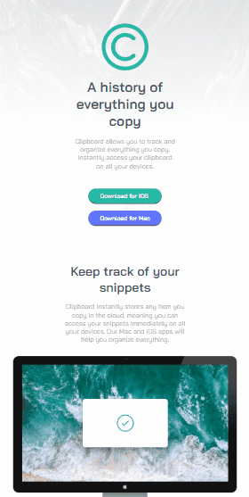

# Desafio Landing Page Clipboard - Frontend-Mentor

Este é um desafio de Landing Page para a Clipboard proposto pelo site Frontend-Mentor.

## Tabela de Conteúdos

- [Visão Geral](#visão-geral)
    - [Imagens](#imagens)
    - [Link da página](#link)
- [Processo](#processo)
    - [Linguagens utilizadas](#linguagens-utilizadas)
    - [O que aprendi](#o-que-aprendi)
    - [Possíveis evoluções](#possíveis-evoluções)
- [Autor](#autor)

## Visão-geral

### Imagens

<br>

````
Versão de Desktop
````

   

<br>

````
Versão Mobile
````

 

### Link

- Página no GitHub Pages: <a href="https://julio-mansan2.github.io/landing-page-clipboard/">Clique aqui!</a>

## Processo

### Linguagens utilizadas

<br>

- Marcações semânticas de HTML5
- Propriedades de customização do CSS3

<br>

### O que aprendi

<br>

- Utilizar rem ao invés de px:

````css

.header h1 {
    margin-bottom: 1.25rem;
    font-size: 2.3rem;
}

````

<br>

- Encaixar elementos fora da tela:

````css

.benefits img {
    margin-left: -1.9rem;
}

````
<br>

- Aplicar porcentagem para medidas:

````css

.call-to-action {
    padding: 10% 30%;
}

````
<br>

### Possíveis evoluções

<br>

- Escrever códigos mais compactos;
- Centralizar os elementos de forma mais coerente;
- Colocar todos os elementos de uma lista (por exemplo) com a mesma largura de forma responsiva.

<br>

## Autor

GitHub - <a href="https://github.com/julio-mansan2">julio-mansan2</a> <br>
Front-end Mentor - <a href="https://www.frontendmentor.io/profile/julio-mansan2">julio-mansan2</a> <br>